# Agent Intercom

A git-backed message bus, lock registry and deadline watchdog for **teams of AI coding agents** — Claude Code, OpenCode, Codex, Aider, or any agent that can run a shell command.



One Python file, standard library only, no server, no API keys. The transport is a git branch.

```bash
git clone https://github.com/<you>/agent-intercom.git ~/intercom
cd ~/intercom && python3 intercom.py init --roles human,lead,builder,verifier
python3 intercom.py post --from lead --to builder --type task \
  --subject "Add retry to the upload path" --body-file task.md --needs-ack --deadline 2026-02-01
python3 intercom.py watch builder --notify      # the builder agent's wake-up loop
python3 intercom.py due --silence-min 60        # who is overdue, who went quiet
```

## Why this exists

Running two or three agents in parallel sounds like a force multiplier and turns into a coordination problem within an hour. They overwrite each other's worktrees, they re-decide questions that were already settled, they wait for each other in silence, and the human becomes a message queue with legs — copying text from one terminal into another.

Agent Intercom fixes the boring part of that: **who said what, who owes an answer, who holds which resource, and who has gone quiet.** It does not orchestrate your agents and it does not run them. It gives them a shared, auditable channel and a way to be woken up.

Read [`WHITEPAPER.md`](WHITEPAPER.md) for the model, and [`LESSONS_LEARNED.md`](LESSONS_LEARNED.md) for the failure modes we hit before it worked.

## How it works

Every message is one markdown file with YAML front matter under `messages/`, committed and pushed to a dedicated git branch (default: `intercom`). Every agent runs on its own machine or worktree, pulls that branch, and reads the messages addressed to it.

```
---
id: 20260215T101533Z-lead-a4f1
ts: 2026-02-15T10:15:33+00:00
from: lead
to: builder, verifier
type: task
subject: Add retry to the upload path
re:
needs_ack: true
deadline: 2026-02-16
refs: src/upload.py@feature/retry@a1b2c3d
---
Three attempts, exponential backoff, no retry on 4xx.
Definition of done: unit test that fails without the change.
```

That is the whole protocol. Because it is git, you get history, blame, offline work, and conflict handling for free — and any agent that can run `git` and `python3` can join.

| Command | What it does |
|---|---|
| `init` | writes `intercom.json` (roles, branch, remotes) |
| `post` | write a message, render inboxes, commit, push |
| `ack` | acknowledge a message that required one |
| `inbox <role> [--open]` | what is addressed to this role; `--open` = still needs an answer |
| `watch <role>` | long-running wake-up loop; prints one line per new message. `--peers-every N` also watches the other roles, `--auto-ping` wakes them |
| `heartbeat <role> --note "..."` | cheap "I am alive and working on X" — a file, not a message |
| `standby <role> [--off]` | park a role: quiet is expected, do not wake it |
| `peers --me <role>` | who is alive? one line per role, exit 1 if anyone is quiet; `--auto-ping` sends the wake-up |
| `due` | **watchdog**: overdue deadlines, unanswered messages, roles that went silent |
| `lock acquire\|release\|list` | claim a worktree/branch/resource so two agents cannot touch it at once |
| `render` / `sync` | regenerate `INBOX-*.md`/`LOCKS.md`, or just fetch/push |

Message types are a closed list: `task, handoff, gate, decision, question, answer, correction, plan, ping, ack, fyi, block`. The list is deliberately short — the type tells the receiving agent what is expected of it.

## Setup

**1. One repository, one branch.** Use a dedicated repo (like this one) or an orphan branch in an existing one. Every participant clones it into its own directory — never into a worktree that an agent is editing.

```bash
git clone <repo> ~/intercom && cd ~/intercom
git checkout --orphan intercom && git rm -rf . 2>/dev/null; true
python3 intercom.py init --roles human,lead,builder,verifier
git add -A && git commit -m "intercom: init" && git push -u origin intercom
```

**2. Give each agent its role and its rules.** Copy the matching file from [`prompts/`](prompts/) into the agent's system prompt, `CLAUDE.md`, `AGENTS.md`, or whatever your tool reads at startup. The prompts are short on purpose; the rules that matter are in them.

**3. Start a wake-up loop per agent.** An agent that is not woken will sit idle forever — this is the single most important lesson in this repo:

```bash
python3 intercom.py watch builder --notify        # foreground, or under your agent's monitor/task runner
python3 intercom.py watch builder --once          # for cron / hooks
python3 intercom.py due --silence-min 45          # exit code 1 when something needs attention
```

**4. Let the agents watch each other.** One watchdog on the lead is not enough — the lead is exactly the agent that will be busy when a partner stalls. Every agent's wake-up loop can watch the others:

```bash
python3 intercom.py watch builder --peers-every 15 --auto-ping   # watches its own inbox AND the other roles
python3 intercom.py heartbeat builder --note "refactor upload path"  # call this while you work
python3 intercom.py peers --me lead                              # one-off: who is alive?
```

A role counts as alive if it sent a heartbeat, posted a message, or moved a git ref you told the tool to track:

```json
"activity_sources": { "verifier": { "repo": "/path/to/repo", "refs": ["origin/verify"] } }
```

**Then test it, unannounced.** Send a message at a moment the other agent does not expect and require an answer with three values: when it arrived, when they reacted, which mechanism fired. Pass threshold: they react without human help inside your chosen window. We set this up, felt done — and the first real test came back at **50 minutes**: the scheduled job we had built made the stall visible to the human but never reached the agent. Find out which of the two you have before you rely on it, and check what your tool actually offers (an idle-event hook in a plugin, a server mode that can inject a prompt into a running session, or nothing — in which case route the work through a person and say so).

That last part matters: an agent can be working hard and saying nothing. Watching only the message channel reports it as dead; watching its branch tells the truth. When a role does go quiet, `--auto-ping` sends exactly one wake-up message per silence episode (cooldown configurable), so a stall is noticed in minutes instead of hours — by whichever agent notices first, not only by the lead.

**5. Lock before you touch shared state.**

```bash
python3 intercom.py lock acquire ~/worktree-api --holder builder --purpose "JIRA-812 retry"
# exit code 2 means: held by someone else. Ask, do not take over.
```

## Configuration

`intercom.json`:

```json
{
  "roles": ["human", "lead", "builder", "verifier"],
  "branch": "intercom",
  "remote": "origin",
  "extra_remotes": ["backup"],
  "silence_alert_minutes": 60,
  "heartbeat_alert_minutes": 45,
  "human_roles": ["human"],
  "auto_ping_cooldown_minutes": 30,
  "activity_sources": { "verifier": { "repo": "/path/to/repo", "refs": ["origin/verify"] } }
}
```

Roles are yours to choose. A team of two (`human`, `agent`) works; the four above are a good default for build/verify separation. `all` is reserved as a broadcast target. Environment overrides: `INTERCOM_ROOT`, `INTERCOM_REMOTE`, `INTERCOM_BRANCH`.

## Requirements

Python 3.9+, git, a shell. macOS gets desktop notifications with `--notify`; everything else works everywhere.

## What this is not

Not a task tracker (use issues), not an orchestrator (your agents keep their own runtimes), not a chat app for humans. It is the thin, auditable layer between agents that otherwise talk past each other.

## License

MIT — see [`LICENSE`](LICENSE).
